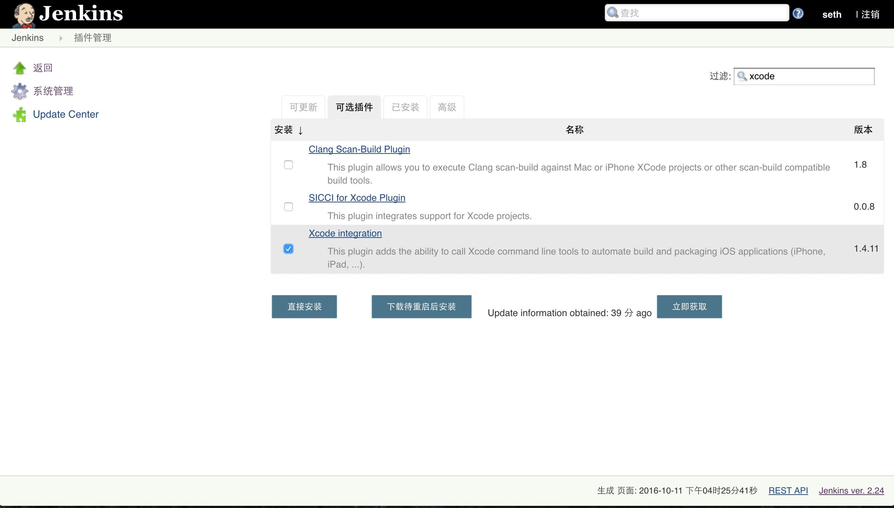

#使用Jenkins进行自动打包
###安装
1. 使用homebrew安装
	
	~~~sh
	//如果没有安装homebrew	
	$/usr/bin/ruby -e "$(curl -fsSL https://raw.githubusercontent.com/Homebrew/install/master/install)"
	//如果没有安装JDK
	$brew install Caskroom/cask/java
	//安装Jenkins
	$brew install jenkins
	~~~
	
2. 前往[Jenkins官网](https://jenkins.io/index.html)下载war包，需要提前安装JDK，然后运行命令：
 
	~~~sh
	$java -jar jenkins.war
	~~~
安装完毕后打开[http://localhost:8080](http://localhost:8080)，如正常打开，则Jenkins安装成功。进入页面后遵循提示，Jenkins会要求进行一些初始化设置，如下： 
复制标红文字，在finder中打开该文件，复制其中内容粘贴到输入框，点击continue

安装插件，这里直接默认选择，等待其安装完毕

创建用户用于后期登录用

创建完用户即可完全进入Jenkins

###安装打包相关插件
进入`系统管理>管理插件>可选插件`，右上角`过滤`中输入`xcode`，勾选上`Xcode integration`，清空`过滤`，再输入`keychain`，勾选上`Keychains and Provisioning Profiles Management`，左下角点击直接安装

###Keychains and Provisioning Profiles Management
上一步完成后来到`系统设置>Keychains and Provisioning Profiles Management`，此处需要上传打包用到的证书及描述文件： 
1. 上传login.keychain,首先确认你所要用到的打包证书已经安装到钥匙串中，在Finder中打开目录`/Users/你的用户名/Library/Keychains/login.keychain`，将login.keychain文件拖拽到`upload`按钮处，点击上传，上传后即出现下图所示，password为登录本机的密码，code signing Identity填打包要用的证书通用名称，该通用名称可在钥匙串中双击你的证书，看到常用名称，复制填入即可。
2. 上传MobileProvision文件，`
 	Provisioning Profiles Directory Path`填写为`/Users/你的用户名/Library/MobileDevice/Provisioning Profiles`，在Finder中打开该路径，然后选中所需要的描述文件拖拽上传，上传后`Filename`和`UUID`会自动读取

###开始使用
* 进入Jenkins首页，选择新建，输入项目名称，选择`构建一个自由风格的项目`，点击`OK`，进入工程详细配置页。
* 配置`源码管理`，这里以git为参考，输入git仓库地址，点击Add配置进入该仓库的用户名和密码  
* 配置`构建环境`，勾选`Keychains and Code Signing Identities`，选择正确的配置项勾选Mobile Provisioning Profiles，并正确配置，此处如果无法看到证书或描述文件，点击底部保存后重新进入即可。
* 配置`构建`,选择`增加构建步骤>Xcode` 输入你要打包的target 点击`Settings`，根据需要自行配置，勾选中`Pack application and build .ipa`，配置最终ipa包名字及ipa包输出目录，配置`Advanced Xcode build options`，此处需要注意的是如果使用了cocoapods的工程，需要填写xcworkspace文件名，此外，如果仓库中工程目录类似这种:

>Example
>>MyProject
>>>MyProject 
>>>MyProject.xcodeproj

可以看到实际xcodeproj文件位于Example/MyProject下，则需要设置`Xcode Project Directory`指定xcodeproj所在目录

* 完成上述操作后，保存会自动回到当前项目总览页面，点击`配置`即回到上述页面进行项目配置，点击`立即构建`则会立即进行打包，打包成功左下角会每次构建结果，蓝色icon提示，否则红色，点击某条构建结果会进入构建详情页，选中`Console Output`即可查看错误原因
成功后即可在你所设置的ipa输出目录中找到ipa包。